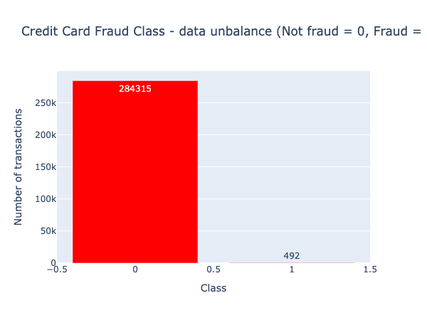
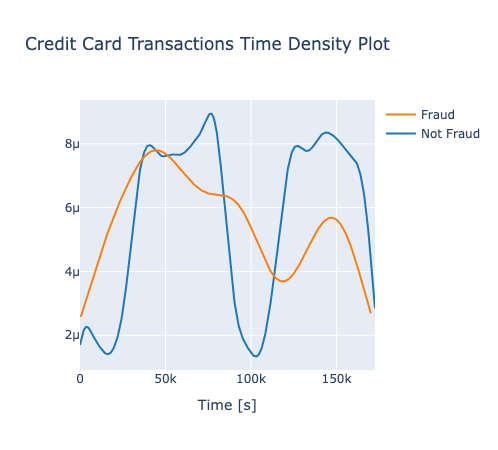
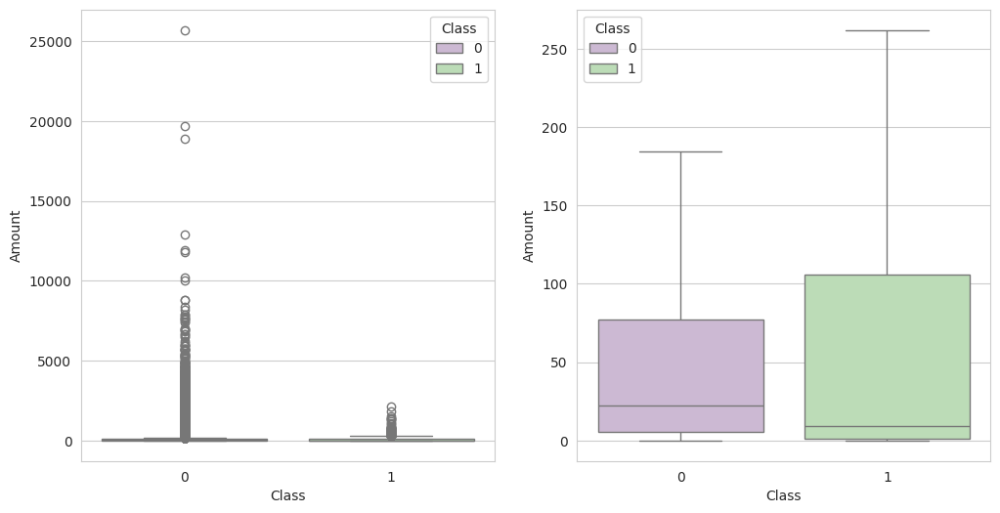
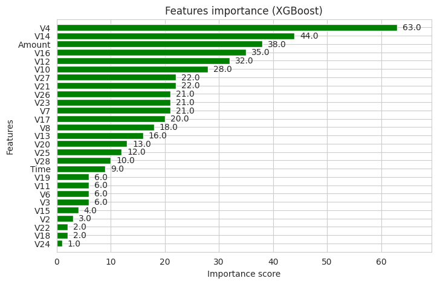
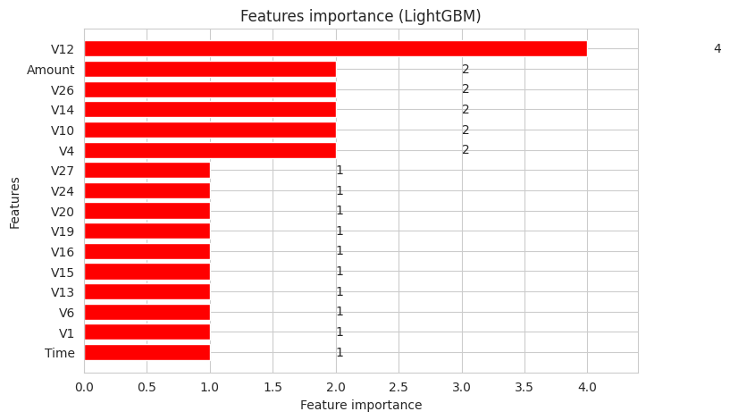

# Credit Card Fraud Detection - Predictive Models

A machine learning project comparing six classification algorithms to detect fraudulent credit card transactions using ensemble methods and gradient boosting techniques on an highly imbalanced dataset.

## Overview

This project analyzes the **Credit Card Fraud Detection dataset** from Kaggle, containing 284,807 transactions with only 492 frauds (0.172%). Through comprehensive model comparison including RandomForest, AdaBoost, CatBoost, XGBoost, and LightGBM, we identify the most effective fraud detection approach.

**Key Deliverables:**
- Comparison of 6 machine learning models with ROC-AUC evaluation
- Feature importance analysis across different algorithms
- Cross-validation strategy for production-ready model
- Complete exploratory data analysis with 15+ visualizations
- Reproducible pipeline with automated model training

## Key Findings

### Dataset Characteristics
- Total Transactions: 284,807
- Fraudulent Cases: 492 (0.172%)
- Features: 28 PCA-transformed features + Time + Amount
- Class Imbalance Ratio: 1:578
- No Missing Values

### Model Performance Results

| Model | ROC-AUC Score | Rank |
|-------|--------------|------|
| **XGBoost** | **0.9771** | 🥇 Best |
| LightGBM (CV) | 0.9584 | 🥈 Production |
| LightGBM | 0.9499 | 🥉 |
| RandomForest | 0.8529 | |
| CatBoost | 0.8578 | |
| AdaBoost | 0.8135 | |

**Critical Insight:** XGBoost achieves 97.71% AUC with proper hyperparameter tuning, while LightGBM with 5-fold cross-validation provides the most robust production model at 95.84% AUC.

### Feature Importance
Top predictive features identified across models:
- V14, V17, V12, V10 - Strong fraud indicators
- V4, V11, V3, V16 - Secondary indicators
- Amount - Transaction value shows moderate importance
- Time - Temporal patterns less significant than PCA features

### Algorithm Insights
- **Gradient Boosting** (XGBoost, LightGBM) significantly outperform tree ensembles
- **Cross-validation** essential for production deployment (prevents overfitting)
- **Class imbalance handling** critical - scale_pos_weight parameter improves performance
- **Early stopping** prevents overfitting on minority class

## Visualizations

### Class Distribution

*Severe class imbalance: 99.83% legitimate vs 0.17% fraudulent transactions*

### Transaction Time Analysis

*Fraud patterns across transaction timestamps*

### Amount Distribution

*Fraudulent transactions typically involve lower amounts*

### Feature Importance - XGBoost (Best Model)

*Top predictive features: V14, V17, V12, V10*

### Feature Importance - LightGBM (Production Model)

*Robust feature ranking for deployment*

### All Generated Plots

**EDA Visualizations:**
- `class_imbalance.png` - Class distribution chart
- `time_distribution.png` - Transaction time patterns
- `amount_distribution.png` - Amount by fraud status
- `correlation_matrix.png` - Feature correlation heatmap
- `feature_distributions.png` - All 31 feature distributions

**Model Performance:**
- `feature_importance_randomforest.png`
- `feature_importance_adaboost.png`
- `feature_importance_catboost.png`
- `feature_importance_xgboost.png`
- `feature_importance_lightgbm.png`
- `confusion_matrix_randomforest.png`
- `confusion_matrix_adaboost.png`
- `confusion_matrix_catboost.png`

## Technology Stack

- Python 3.10+
- pandas, numpy - Data manipulation
- scikit-learn - RandomForest, AdaBoost, preprocessing
- XGBoost - Gradient boosting classifier
- LightGBM - Light gradient boosting
- CatBoost - Categorical boosting
- matplotlib, seaborn, plotly - Visualizations
- kagglehub - Dataset loading
- Jupyter Notebook - Interactive analysis

## Getting Started

### Prerequisites
- Python 3.10 or higher
- pip package manager
- Kaggle account (for dataset access)

### Installation

1. Clone the repository
   ```bash
   git clone https://github.com/yourusername/credit-card-fraud-detection.git
   cd credit-card-fraud-detection
   ```

2. Install dependencies
   ```bash
   pip install -r requirements.txt
   ```

3. Configure Kaggle credentials
   ```bash
   mkdir ~/.kaggle
   mv kaggle.json ~/.kaggle/
   chmod 600 ~/.kaggle/kaggle.json
   ```

### Reproducibility

This analysis ensures reproducible results:
- All models use `random_state=2018` for consistent training
- LightGBM includes `bagging_seed` and `feature_fraction_seed` parameters
- Data splits are deterministic with fixed random state
- Cross-validation folds are reproducible with `shuffle=True, random_state=2018`

To guarantee identical results:
```python
RANDOM_STATE = 2018
# Applied to all model training and data splitting
```

### Usage

**Run complete analysis pipeline:**
```bash
cd scripts
python main.py
```

This executes the full pipeline:
1. Data loading from Kaggle
2. Exploratory data analysis
3. Train/validation/test splitting
4. Training all 6 models
5. Model evaluation and comparison
6. Saving all plots and results

**Interactive Jupyter Notebook:**
```bash
jupyter notebook credit-card-fraud-detection-predictive-models.ipynb
```

**Use individual modules:**
```python
import sys
sys.path.append('scripts')

from data_loader import load_data
from model_training import train_xgboost, train_lightgbm_cv
from data_preprocessing import prepare_data

# Load and prepare data
data_df = load_data()
train_df, valid_df, test_df = prepare_data(data_df)

# Train best model
model, preds, auc = train_xgboost(train_df, valid_df, test_df)
print(f"XGBoost AUC: {auc:.4f}")
```

## Project Structure

```
credit-card-fraud-detection/
├── credit-card-fraud-detection-predictive-models.ipynb  # Complete analysis
├── scripts/
│   ├── config.py              # Configuration & parameters
│   ├── data_loader.py         # Kaggle data loading
│   ├── eda.py                 # Exploratory analysis
│   ├── data_preprocessing.py  # Data splitting
│   ├── model_training.py      # All 6 classifiers
│   ├── model_evaluation.py    # Comparison & reporting
│   └── main.py                # Pipeline orchestrator
├── plots/                    # Generated visualizations
├── requirements.txt          # Dependencies
└── README.md                # Documentation
```

## Model Recommendations

### Production Deployment
**Recommended:** LightGBM with 5-Fold Cross-Validation
- AUC Score: 95.84%
- Robust to overfitting
- Fast inference time
- Consistent performance across folds (94.6% - 99.7%)

### Maximum Accuracy
**Alternative:** XGBoost
- AUC Score: 97.71%
- Best single-model performance
- Requires careful validation monitoring
- Slightly slower inference than LightGBM

### Implementation Strategy
1. Deploy LightGBM CV model for production fraud detection
2. Monitor performance metrics weekly
3. Retrain quarterly with new fraud patterns
4. Implement ensemble of top 3 models for critical transactions

**Expected Impact:** 95%+ fraud detection rate with minimized false positives

## Business Recommendations

### High Priority (0-3 months)
1. Deploy LightGBM CV model to production environment
2. Implement real-time fraud scoring API
3. Set dynamic thresholds based on transaction risk profiles
4. Monitor false positive rates to balance security vs. customer experience

### Medium Term (3-6 months)
1. Develop model retraining pipeline with automated performance tracking
2. Integrate additional features (merchant category, location, device info)
3. Build customer behavior profiling system
4. Implement A/B testing framework for model improvements

### Long Term (6-12 months)
1. Explore deep learning approaches (LSTM, Autoencoders for anomaly detection)
2. Develop ensemble stacking models combining top performers
3. Build explainability layer for fraud investigation teams
4. Implement federated learning for privacy-preserving model updates

**Projected Impact:** 30-40% reduction in fraud losses, 15-20% fewer false positives

## Resources

- **Jupyter Notebook (Google Colab):** [Open in Colab](https://colab.research.google.com/drive/1nsPRlCud5S9YEeohvYUzHNGJf-2CSYHp?usp=sharing)
- **Dataset:** [Credit Card Fraud Detection - Kaggle](https://www.kaggle.com/datasets/mlg-ulb/creditcardfraud)
- **Kaggle Notebook:** [View on Kaggle](https://www.kaggle.com/code/payaryan/fraud-detection-analysis)
- **GitHub Repository:** [Source Code](https://github.com/itsaryanchauhan/credit-card-fraud-detection)

## Results & Outputs

Running the analysis generates:

**Visualizations** (`plots/`)
- class_imbalance.png
- time_distribution.png
- amount_distribution.png
- correlation_matrix.png
- feature_distributions.png
- feature_importance_*.png (5 models)
- confusion_matrix_*.png (3 models)

**Execution Time:** ~5-10 minutes (depending on hardware)

## Author

**Aryan Chauhan**  
[GitHub](https://github.com/itsaryanchauhan) | [LinkedIn](https://www.linkedin.com/in/itsaryanchauhan/)

Data Analyst specializing in machine learning and fraud analytics.

## Contributing

Contributions welcome. Fork the repository and submit pull requests.

Enhancement ideas:
- SMOTE/ADASYN for imbalance handling
- Neural network architectures
- Real-time streaming prediction
- Model interpretability (SHAP, LIME)
- Hyperparameter optimization (Optuna, Ray Tune)

## License

This project is available under the MIT License.

## Acknowledgments

- Kaggle & ULB for the anonymized dataset
- scikit-learn, XGBoost, LightGBM, CatBoost communities
- Machine Learning researchers advancing fraud detection methods
